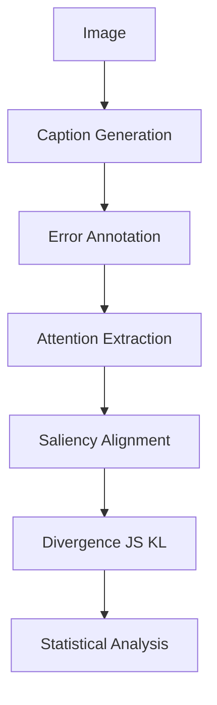

# Do Image Captioning Models Fail Like Humans?

### A Cognitive Analysis of Perceptual Errors in Vision–Language Systems

---

## 📌 Overview

This repository presents a **cognitive analysis of perceptual errors** in pretrained image captioning models.

Instead of improving accuracy, this project investigates:

> **When models fail, do they fail in a human-like way?**

We analyze **error structure, hallucination behavior, and attention alignment** to understand whether model failures resemble human perceptual reasoning.

---

## 🎯 Key Contributions

* **CSS Metric (Cognitive Similarity Score)**
  A structured metric for evaluating semantic misalignment beyond BLEU.

* **Human-Aligned Error Taxonomy**
  Manual annotation of perceptual errors:

  * Hallucination
  * Misidentification
  * Attribute mismatch
  * Relation mismatch

* **Attention-Based Analysis**
  Cross-attention maps aligned with human saliency (SALICON).

* **Cross-Model Evaluation**
  Comparison across BLIP and ViT-GPT2 captioning models.

---

## ❓ Research Questions

* **RQ1:** Do models exhibit structured error patterns similar to human cognition?
* **RQ2:** Are hallucinations driven by language priors?
* **RQ3:** Is attention misalignment correlated with perceptual errors?

---

## ⚙️ Pipeline



---

## 📊 Key Results

* **No significant difference at caption level**
* **Token-level divergence is significant**

  * p ≈ 0.026
  * Cohen’s d ≈ -0.74

### Insight:

> Models can attend correctly while still generating incorrect semantics.

This highlights a separation between:

* **Perceptual alignment**
* **Semantic grounding**

---

## 📁 Repository Structure

```text
data/        # annotations and metadata
docs/        # research paper and methodology
results/     # final tables, summaries, figures
notebooks/   # analysis pipelines
src/         # reusable code modules
```

---

## 🚀 How to Run

```bash
pip install -r requirements.txt
jupyter notebook
```

Run notebooks in order:

1. `01_setup_and_dataset.ipynb`
2. `02_caption_generation.ipynb`
3. `03_metric_computation.ipynb`
4. `04_annotation.ipynb`
5. `05_attention_analysis.ipynb`
6. `06_cross_model_analysis.ipynb`

---

## 📄 Research Paper

The full research paper is available here:
👉 [paper.pdf](docs/paper.pdf)

---

## 👥 Contributors

**Abhidhey Singh**

* Metric design (CSS)
* Pipeline architecture
* Statistical analysis

**Sneha Mishra**

* Error taxonomy
* Manual annotation
* Cognitive categorization

**Shivani Rathore**

* Attention extraction
* Saliency alignment
* Visualization

---

---

## ⚖️ Ethics & Data Usage

* COCO and SALICON datasets are **not redistributed**
* Only derived metadata and annotations are included
* This work studies **error structure**, not human cognition modeling

---

## 📌 What This Is NOT

* Not a benchmark repo
* Not a model improvement project
* Not a leaderboard submission

This is a **research-focused analysis of failure behavior**.

---

## 📚 Citation

Please use `CITATION.cff` if referencing this work.

---

## 📄 License

MIT License
