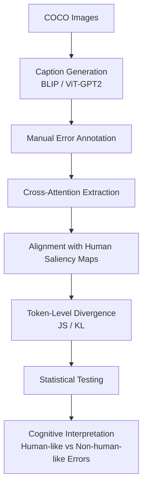

# Do Image Captioning Models Fail Like Humans?  
### A Cognitive Analysis of Perceptual Errors in Vision–Language Systems

---

## Overview

This repository presents an empirical cognitive study of perceptual error structure in pretrained image captioning models.

Rather than optimizing model performance or introducing architectural modifications, this project investigates whether structured perceptual failure in vision–language systems resembles human cognitive error patterns.

The central question of this project is not:

> “How accurate is the model?”

but rather:

> “When the model is wrong, is it wrong in a human-like way?”

This is a structured empirical research project focused on cognitive analysis, not a benchmark, leaderboard, or model development repository.

---

## Core Philosophy

This project explicitly avoids:

- Improving model accuracy  
- Training new architectures  
- Optimizing captioning performance  
- Competing on benchmarks  

Instead, it focuses on:

- Studying structured perceptual failure  
- Comparing AI error structure to human cognitive error categories  
- Using attention analysis as explanatory evidence  
- Maintaining strict separation between spatial alignment and semantic grounding  

---

## Research Questions

### RQ1 — Error Taxonomy & Structure  
Do pretrained captioning models exhibit structured perceptual error patterns that overlap with cognitively defined human error categories, or are they qualitatively distinct?

### RQ2 — Hallucination & Prior Bias  
Are hallucination errors driven by contextual language priors rather than perceptual evidence, and how does this compare to human prior-driven inference?

### RQ3 — Attention & Misalignment  
Is attention misalignment systematically associated with specific perceptual error categories?

---

## Dataset

- 50 images from COCO val2014  
- Paired with SALICON human saliency maps  
- Manual perceptual error annotations  

To ensure compliance with dataset licensing:

- No COCO images are redistributed in this repository  
- No SALICON fixation files are redistributed  
- Only image IDs and derived measurements are included  

See `data/raw/download_instructions.md` for acquisition details.

---

## Model

- Pretrained BLIP captioning model  
- Cross-attention extracted at token-level  
- Attention aligned to 24×24 spatial grid  
- Jensen–Shannon (JS) and KL divergence computed against normalized human saliency  

No model training or fine-tuning is performed.

---

## Methodological Summary

This study follows a five-stage empirical pipeline:

1. Caption generation using a pretrained BLIP model  
2. Manual annotation of perceptual errors  
3. Extraction of token-level cross-attention  
4. Alignment with human saliency (24×24 grid normalization)  
5. Divergence computation and statistical testing  

All analysis is post-hoc and does not involve model modification.

## Experimental Pipeline

The empirical analysis follows the pipeline below:

---

## Current Empirical State

- 38 correct captions  
- 12 perceptual error captions  

Error types:
- Hallucination  
- Misidentification  
- Attribute mismatch  
- Relation mismatch  

### Statistical Findings

No statistically significant difference was observed at the caption level.

At the token level:

- error_token_JS < non_error_JS  
- p = 0.026  
- Cohen’s d ≈ -0.74  

### Interpretation

Spatial attention alignment is neither necessary nor sufficient for semantic correctness.

The model frequently attends to visually salient regions even when generating semantically incorrect tokens.

This suggests a structural separation between:

- Perceptual alignment  
- Semantic grounding  

Human-like spatial attention patterns do not imply human-like perceptual reasoning.

---

## Repository Structure

- cognitive-captioning-errors/

- ├── docs/ # Conceptual and methodological framework
- ├── data/ # Raw metadata, processed outputs, annotations
- ├── models/ # Model configuration documentation
- ├── analysis/ # Notebooks for divergence and statistical testing
- ├── results/ # Tables, figures, interpretation notes
- ├── environment/ # Reproducible environment configuration
- └── project_management/ # Milestones, roadmap, issue templates

### Separation Principles

- `data/` → contains only datasets and derived measurements  
- `analysis/` → contains computational notebooks  
- `results/` → contains finalized outputs  
- `docs/` → contains conceptual and methodological documentation  

This separation ensures clarity between empirical evidence, analysis, and interpretation.

---

## Contributors

### Abhidhey Singh
- Cognitive framing  
- Token-level divergence analysis  
- Statistical testing  
- Theory integration  

### Sneha Mishra
- Error taxonomy construction  
- Manual annotation  
- Human comparison design  
- Category refinement  

### Shivani Rathore
- Cross-attention extraction  
- Saliency preprocessing  
- Spatial alignment implementation  

Each contributor’s role is structurally separated within the repository.

---

## Reproducibility

See `docs/reproducibility_protocol.md` for:

1. Dataset acquisition instructions  
2. Attention extraction procedure  
3. Saliency normalization  
4. Divergence computation  
5. Statistical testing protocol  

The repository includes:

- `requirements.txt`  
- `environment.yml`  
- Fixed random seeds  
- Explicit model version documentation  

Expected core result:

- p ≈ 0.026  
- Cohen’s d ≈ -0.74  

---

## Ethical and Licensing Notes

- COCO dataset used under official licensing terms  
- SALICON dataset used under original usage conditions  
- No redistribution of copyrighted image data  
- Manual annotations created by contributors  
- This project does not attempt to model or diagnose human cognitive impairments  

This study investigates structural similarities in error patterns, not human deficiency modeling.

---

## What This Repository Is Not

- Not a benchmark repository  
- Not a model improvement project  
- Not a leaderboard submission  
- Not an application deployment  

This is a structured cognitive analysis of perceptual failure in vision–language systems.

---

## License

This repository is released under the MIT License.

See `LICENSE` for details.

---

## Citation

If referencing this work, please use the citation file provided in `CITATION.cff`.

---

## Project Status

Ongoing minor research project.

Prepared for faculty review.
